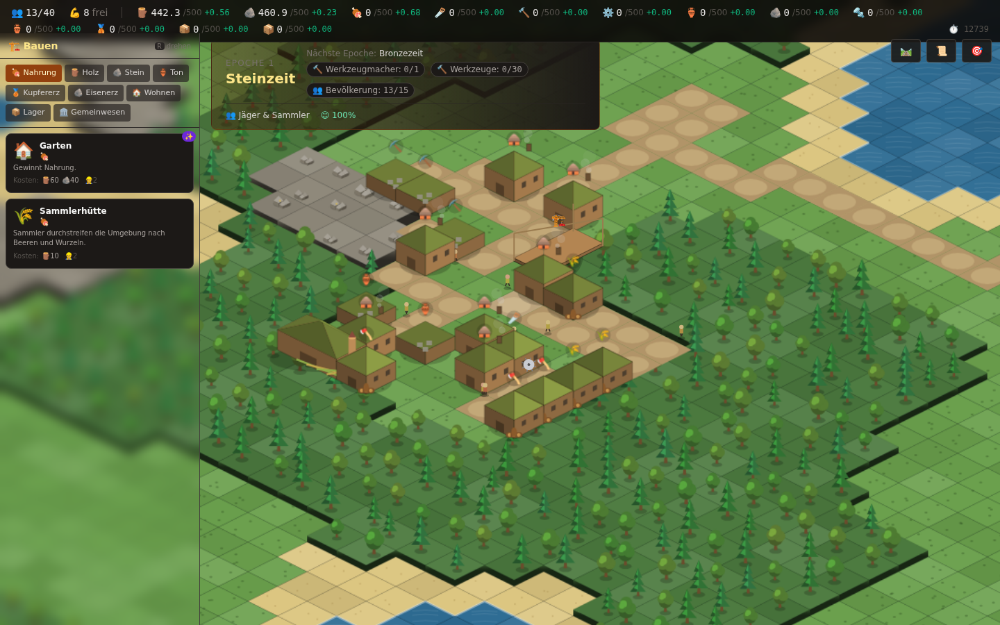
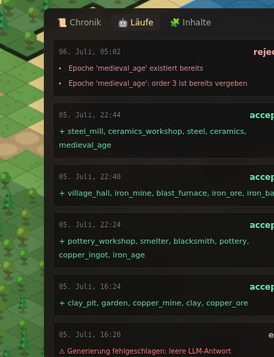

# 🏛️ Idlevolution

**Ein vollgrafisches Aufbauspiel im Anno-Stil, das sich jede Nacht von einer lokalen KI selbst weiterentwickelt.**

Die Spiel-Engine enthält **keine einzige hartcodierte Spielmechanik-Instanz** — jedes Gebäude, jede Ressource, jede Produktionskette und jedes Zeitalter kommt aus JSON-Content-Packs in `data/content/`. Nachts analysiert eine lokale KI (Gemma via llama.cpp) den aktuellen Spielstand und erweitert das Spiel eigenständig um neue Inhalte. Der Mensch behält dabei volle Transparenz und Kontrolle.



---

## Inhaltsverzeichnis

- [Was das Spiel ist](#-was-das-spiel-ist)
- [Der weitere Zweck der lokalen KI](#-der-weitere-zweck-der-lokalen-ki)
- [Schnellstart](#-schnellstart)
- [Architektur](#-architektur)
- [Die nächtliche KI-Pipeline](#-die-nächtliche-ki-pipeline)
- [Menschliche Aufsicht & Sicherheit](#-menschliche-aufsicht--sicherheit)
- [Data-driven Content & Grafik](#-data-driven-content--grafik)
- [API](#-api)
- [Konfiguration](#-konfiguration)
- [Backup & Restore](#-backup--restore)
- [Entwicklung](#-entwicklung)
- [Projektstruktur](#-projektstruktur)

---

## 🎮 Was das Spiel ist

Idlevolution ist ein isometrisches Idle-/Aufbauspiel im Browser:

- **Echte Insel-Karte** (48×48) mit prozeduralem Terrain: Wasser, Sandküsten, Gras, Wald und Fels — mit Klippen, Küstenschaum und gemischtem Baumbestand.
- **Baumodus** mit Anno-artigen Platzierungsregeln: Minen brauchen Fels, Fischer brauchen Wasser, Holzfäller brauchen Wald in der Nähe. Grün/Rot-Vorschau, mehrfelder Grundrisse, **Gebäude drehen** (`R`).
- **Prozedural gezeichnete Gebäude** — jeder Typ hat eine eigene Silhouette (Haus, Sägewerk, Mine, Schmelze, Farm, Markt, Turm, Lager …), abgeleitet aus seiner Funktion.
- **NPC-Siedler**, die zwischen Wohnhaus und Arbeitsstätte pendeln und auf Straßen laufen.
- **Straßen & Logistik**: Wege bauen (Linksziehen) und abreißen (Rechtsziehen); Straßenanschluss steigert die Produktion.
- **Wirtschaft**: Produktionsketten (Holz → Bretter → Werkzeuge), Arbeiterzuweisung, Lagerkapazitäten, sichtbare Ketten- und Engpass-Anzeigen.
- **Bevölkerungsstufen & Bedürfnisse**: Jede Epoche hat eine Bevölkerungsstufe (Jäger & Sammler → Siedler → …) mit Güter-Bedürfnissen, die die Zufriedenheit und damit das Wachstum steuern.
- **Zeitalter-Fortschritt**, Tag/Nacht-Zyklus, Minimap, Offline-Progression.

Und das Wichtigste: **Der Inhalt wächst weiter, ohne dass jemand ihn programmiert.**

---

## 🤖 Der weitere Zweck der lokalen KI

Ursprünglich war die lokale KI nur ein „Content-Generator". Mit den eingebauten Aufsichts- und Sicherheitswerkzeugen erfüllt sie ab jetzt eine **erweiterte Rolle**:

### 1. Autonomer Spieldesigner
Die KI ist kein einmaliger Generator, sondern ein **dauerhaft laufender, autonomer Designer**. Jede Nacht:
- liest sie den echten Siedlungs-Status (Lücken, Engpässe, Terrain-Verteilung, Zufriedenheit, bisherige Ablehnungen),
- erfindet passende neue Ressourcen, Gebäude, Produktionsketten, Bevölkerungsstufen und ganze Zeitalter,
- und bestimmt dabei **selbst deren Aussehen** (über `meta.art`) und **deren Platzierungslogik** (Terrain/Nachbarschaft) — vollständig data-driven, ohne dass die Engine das jeweilige Gebäude kennen muss.

Das Spiel ist damit nie „fertig". Es ist ein lebendiges System, das sich Woche für Woche in Richtungen entwickelt, die niemand vorher festgelegt hat.

### 2. Selbstverbessernde Feedback-Schleife
Jeder Lauf wird protokolliert. Abgelehnte Pakete und ihre Gründe fließen in den nächsten Prompt zurück — die KI **lernt aus ihren Fehlern** und wiederholt sie seltener. Balancing-Grenzen, Erreichbarkeits- und Sandbox-Prüfungen wirken wie ein ständiger Lektor.

### 3. Ein Testfeld für sichere, autonome Software-Evolution
Der eigentliche, weiterreichende Zweck: Idlevolution demonstriert, wie ein **lokales Sprachmodell ein reales, laufendes System offen und unbegrenzt weiterentwickeln kann — ohne die Kontrolle zu verlieren.**

- **Kein hartcodierter Inhalt** → die KI hat echten Gestaltungsspielraum.
- **Mehrstufige Sicherheitsprüfung** → sie kann das System nicht kaputt machen (Struktur, Referenzen, Balancing, Soft-Lock-Wächter, 1000-Tick-Sandbox).
- **Volle Transparenz** → jeder Eingriff ist nachvollziehbar (KI-Protokoll, Chronik).
- **Jederzeit rückholbar** → einzelne Erweiterungen lassen sich per Klick zurückrollen, der Gesamtzustand per Backup wiederherstellen.

Die Rolle des Menschen verschiebt sich damit vom **Autor** zum **Kurator**: nicht mehr Inhalte schreiben, sondern die nächtliche Entwicklung sichten, gutheißen oder gelegentlich einen Ausreißer zurücknehmen. Idlevolution ist in diesem Sinne ein kleines, greifbares Modell für **beaufsichtigte, autonome KI-getriebene Weiterentwicklung** von Software.

---

## 🚀 Schnellstart

Voraussetzungen: Docker + Docker Compose, sowie ein erreichbarer OpenAI-kompatibler LLM-Endpunkt (z. B. [llama.cpp](https://github.com/ggml-org/llama.cpp) / [llama-swap](https://github.com/mostlygeek/llama-swap) mit einem Gemma-Modell).

```bash
cp .env.example .env        # Passwörter, AI_IMPORT_TOKEN und LLM_BASE_URL setzen
docker compose up -d --build
# → Spiel öffnen: http://localhost:8420
```

KI-Generierung manuell auslösen (statt auf den nächtlichen Cron zu warten):

```bash
./scripts/generate-now.sh
```

---

## 🏗️ Architektur

Drei Container, klare Trennung von **Code**, **dynamischem Zustand** und **Inhalt**:

| Service     | Aufgabe |
|-------------|---------|
| `app`       | Fastify-Backend (Node 20, ESM) + gebautes Svelte-4-UI. Lädt die Content-Packs, führt die Tick-Simulation aus, dient die API und persistiert den Spielstand in PostgreSQL. |
| `db`        | PostgreSQL 16 — **nur dynamischer Zustand** (Bestände, platzierte Gebäude, Straßen, Epoche, Audit-Log). Content-Definitionen bleiben Dateien. |
| `ai-worker` | Cron-Scheduler (`AI_CRON`, Standard 03:00). Holt den Siedlungs-Status, ruft das LLM und reicht das Ergebnis über die API zum Import ein. |

- **Stack:** Fastify · PostgreSQL 16 · Svelte 4 + Tailwind 3 · Canvas-Rendering (kein WebGL nötig) · Node-Test-Runner.
- **Datenfluss der Inhalte:** ausschließlich Dateien → `app` lädt & merged sie → `/api/content` → das UI rendert nur, was hier ankommt.

---

## 🌙 Die nächtliche KI-Pipeline

```
                    ┌─────────────── ai-worker (Cron 03:00) ───────────────┐
                    │                                                      │
 GET /api/ai/export │   Siedlungs-Status  ──►  Prompt  ──►  gemma4-12b     │
 (Lücken, Raten,    │        ▲                                  │          │
  Zufriedenheit,    │        │                             JSON-Pack       │
  letzte Ablehnungen)│       │                                  │          │
                    └────────┼──────────────────────────────────┼─────────┘
                             │                                   ▼
                             │                          POST /api/ai/import
       Feedback-Schleife ────┘                                   │
                                                                 ▼
   Hot-Reload ◄── Datei speichern ◄── Sandbox ◄── Soft-Lock ◄── Balancing ◄── Referenzen ◄── Struktur
   (Registry)     (data/content/     (1000       -Wächter      (Clamping/    (IDs,          (JSON-
                   generated/)        Ticks)                    Ablehnung)    Kollisionen)   Schema)
```

Die KI kann komplett neue Ressourcen, Gebäude (inkl. Grafik und Platzierung), Produktionsketten, Bevölkerungsstufen mit Bedürfnissen und ganze Zeitalter einführen. Über `epochAdvance` liefert sie die Aufstiegsbedingung einer bisher finalen Epoche nach, damit neue Zeitalter erreichbar bleiben.

### Sicherheitsstufen beim Import

1. **Struktur** — JSON-Schema-Validierung (ajv).
2. **Referenzen** — alle IDs existieren, keine Kollisionen mit Bestand.
3. **Normalisierung** — fehlendes `placement`/`meta.art`/`needs`/`tier` wird sicher ergänzt (z. B. Mine→Fels, Fischer→Wasser; Bedürfnis nur mit vorhandenem Produzenten).
4. **Balancing** (`data/balance.config.json`) — kein Perpetuum mobile, Netto-Wertschöpfung ≤ Arbeiter×Grenzwert, max. +25 % über bestem Bestandsgebäude, Mindest-Amortisation. Werte werden wo möglich **gekappt statt abgelehnt**.
5. **Soft-Lock-Wächter** — lehnt Pakete ab, die einen **neuen** Fortschritts-Blocker einführen (unerreichbare Epoche, Bedürfnis/Input ohne Produzenten).
6. **Sandbox** — 1000 Ticks Simulation gegen eine Kopie des Spielstands (fängt Exponential-Explosionen und NaN).

Abgelehntes landet mit Begründung in `data/rejected/`; jeder Lauf wird in der Tabelle `ai_runs` protokolliert.

---

## 🛡️ Menschliche Aufsicht & Sicherheit

Damit die nächtliche Autonomie vertrauenswürdig bleibt, gibt es im Spiel die **KI-Zentrale** (🤖-Button):



- **Chronik** — die erzählerischen Tagesberichte der KI.
- **Läufe** — jeder nächtliche Lauf mit Status, hinzugefügten Inhalten und **konkreten Ablehnungsgründen**.
- **Inhalte** — jedes generierte Pack lässt sich per Klick **deaktivieren** (Datei wird herausgenommen, Hot-Reload, verwaiste Gebäude werden aufgeräumt). Basis-Packs sind geschützt.

Zusätzlich:
- **„Über Nacht erweitert"** — beim Laden eine Zusammenfassung, was die KI seit dem letzten Besuch hinzugefügt hat.
- **Backup/Restore** — Spielzustand und generierte Inhalte lassen sich rotierend sichern und wiederherstellen (siehe unten).

---

## 🧩 Data-driven Content & Grafik

### Content-Packs (`data/content/`)

- `base/` — Start-Inhalte (vom Menschen gepflegt, nummeriert für die Ladereihenfolge).
- `generated/<datum>/` — von der KI erzeugte Packs.
- `disabled/` — vom Nutzer deaktivierte Packs (werden nicht geladen).
- Schemas: `server/src/content/schemas/*.schema.json`.

Ein Pack sieht so aus:

```jsonc
{
  "schemaVersion": 1,
  "pack": { "id": "ai-2026-07-05-abcd", "source": "ai" },
  "chronicle": { "de": "Die ersten Schmelzöfen erhellen die Nacht …" },
  "resources": [{ "id": "copper_ingot", "category": "processed", "epoch": "bronze_age", "baseValue": 8, "... ": "..." }],
  "buildings": [{
    "id": "smelter", "category": "production", "epoch": "bronze_age",
    "production": { "inputs": { "copper_ore": 0.6 }, "outputs": { "copper_ingot": 0.24 } },
    "placement": { "terrain": ["rock"], "adjacent": { "rock": 1 }, "size": { "w": 2, "h": 1 } },
    "meta": { "art": { "shape": "smelter", "accent": "#ff4500" } }
  }],
  "epochs": [{ "id": "iron_age", "order": 2, "tier": { "name": { "de": "Eisenarbeiter" } }, "needs": { "steel": 0.01 } }],
  "epochAdvance": { "bronze_age": { "resources": { "copper_ingot": 0.02 }, "population": 20 } }
}
```

### Prozedurale, KI-steuerbare Grafik

Es gibt **keine Sprite-Dateien**. Jedes Gebäude wird prozedural auf einem Canvas gezeichnet:

- Ein **Klassifikator** leitet den Zeichen-Archetyp aus der Funktion des Gebäudes ab (Produktions-Outputs, Name-Schlüsselwörter). Erfindet die KI z. B. eine „Bronzeschmelze", bekommt sie automatisch eine Schmelzhütten-Silhouette mit glühendem Schornstein.
- Über **`meta.art`** kann die KI das Aussehen explizit steuern: `shape` (house, farm, mine, smelter, sawmill, fishery, market, temple, tower, warehouse …), `accent`, `wall`, `roof`.
- Material folgt der Epoche, Variation der Gebäude-ID.

So kann die KI für neue Zeitalter neue Materialien, Gegenstände, Gebäude und Optik einführen — **ohne dass irgendwo Grafik-Code angefasst werden muss.**

---

## 🔌 API

| Route | Beschreibung |
|-------|--------------|
| `GET /api/content` | Gemergte Content-Definitionen (das UI rendert ausschließlich diese) |
| `GET /api/state` | Spielzustand: Bestände, Raten, Freischaltungen, Epoche/Stufe/Bedürfnisse, Zufriedenheit, Logistik |
| `GET /api/map` | Statische Weltkarte (Terrain) |
| `POST /api/build` `{buildingId, x, y, rot?}` | Gebäude platzieren |
| `POST /api/demolish` `{instanceId}` | Gebäude abreißen (50 % Kostenerstattung) |
| `POST /api/rotate` `{instanceId}` | Gebäude um 90° drehen |
| `POST /api/workers` `{buildingId, delta}` | Arbeiter zuweisen |
| `POST /api/road` `{tiles, on}` | Straßen bauen/abreißen |
| `GET /api/ai-log` | KI-Lauf-Protokoll (öffentlich, für die KI-Zentrale) |
| `POST /api/pack/disable` `{packId}` | Generiertes Pack deaktivieren + aufräumen |
| `GET /api/ai/export` 🔒 | Siedlungs-Status für die KI (Bearer `AI_IMPORT_TOKEN`) |
| `POST /api/ai/import` 🔒 | Pack einreichen → prüfen → balancen → Hot-Reload |
| `GET /api/ai/runs` 🔒 | Lauf-Protokoll (token-geschützt) |

🔒 = nur mit `AI_IMPORT_TOKEN` (Bearer). Diese Routen darf ausschließlich der `ai-worker` aufrufen.

---

## ⚙️ Konfiguration

Alles über `.env` (siehe `.env.example`):

| Variable | Bedeutung |
|----------|-----------|
| `APP_PORT` | Port des Spiels (Standard 8420) |
| `POSTGRES_*` | Datenbank-Zugang |
| `AI_IMPORT_TOKEN` | Token, mit dem der `ai-worker` `/api/ai/*` aufruft |
| `TICK_SECONDS` | Länge eines Simulations-Ticks |
| `PERSIST_EVERY_TICKS` | Speicherintervall |
| `OFFLINE_CAP_HOURS` | Maximal nachgeholte Offline-Progression |
| `LLM_BASE_URL` / `LLM_MODEL` | OpenAI-kompatibler LLM-Endpunkt + Modell |
| `LLM_CTX` / `LLM_MAX_TOKENS` / `LLM_TEMPERATURE` | LLM-Parameter |
| `AI_CRON` | Zeitplan der nächtlichen Generierung (Cron-Syntax) |
| `AI_RUN_ON_START` | Sofortlauf beim Start (Debug) |

---

## 💾 Backup & Restore

```bash
./scripts/backup.sh                       # → data/backups/<timestamp>/ (db.sql.gz + content.tar.gz)
./scripts/restore.sh data/backups/<...>   # Zustand + Inhalte zurückspielen
```

Das Backup rotiert (`BACKUP_KEEP`, Standard 14). Empfohlen als Host-Cron **vor** der nächtlichen KI-Generierung:

```cron
55 2 * * *  cd /opt/Idlevolution && ./scripts/backup.sh >> data/backups/backup.log 2>&1
```

---

## 🧪 Entwicklung

```bash
cd server && npm install && npm test     # 30 Unit-Tests (Validator, Balancer, Engine, Bedürfnisse, Straßen)
cd web && npm install && npm run dev      # Vite-Dev-Server mit API-Proxy auf :8420
```

- **Engine-Tests** laden bewusst nur `base`-Content (`loadRegistry(dir, log, { includeGenerated: false })`) → deterministisch, unabhängig davon, was die KI generiert hat.
- **Rendering** ist reines Canvas-2D mit Offscreen-Sprite-Cache (`createImageBitmap`) — läuft flüssig ohne GPU-Zwang.

---

## 📁 Projektstruktur

```
data/
  balance.config.json        # Spiel-Grundwerte + Balancing-Grenzen
  content/base/              # Start-Inhalte (Mensch)
  content/generated/<datum>/ # KI-Inhalte
  content/disabled/          # deaktivierte Packs
  rejected/                  # abgelehnte KI-Pakete (mit Begründung)
  backups/                   # Backups (backup.sh)
server/
  src/engine/                # Tick-Simulation, Karte, Regeln, Zustand
  src/content/               # Loader, Validator, Balancer, Schemas
  src/ai/                    # Export, Generator (Prompt), Importer, Scheduler
  src/routes/                # game / content / ai
  src/db/migrations/         # SQL-Migrationen
  test/                      # Node-Test-Runner
web/
  src/components/            # IsoMap, BuildPalette, EpochBanner, InfoPanel, Chronicle (KI-Zentrale) …
  src/lib/                   # sprites, iso, npc, chains, placement, api
scripts/                     # generate-now / backup / restore
```

---

*Idlevolution — ein Spiel, das nie fertig wird, weil es sich jede Nacht selbst weiterschreibt.*
